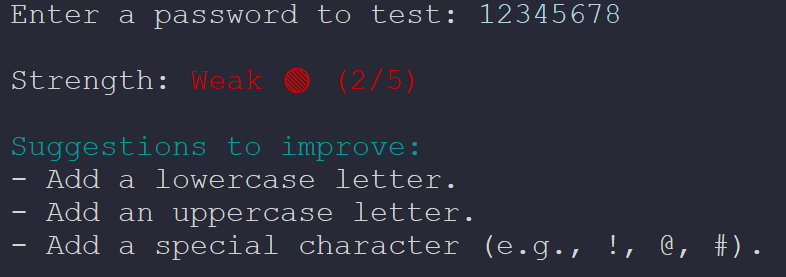

```markdown
# SecurePass - Password Strength Checker




A lightweight, terminal-based Python utility that evaluates the strength of a password in real-time. It analyses the input against standard security rules and provides colour-coded feedback alongside actionable suggestions for improvement.

## Features

- **Multi-Criteria Evaluation**: Checks password strength based on five distinct security vectors:
  - Minimum length (8 or more characters)
  - Lowercase letter inclusion (`[a-z]`)
  - Uppercase letter inclusion (`[A-Z]`)
  - Numeric digit inclusion (`\d`)
  - Special character inclusion (e.g. `!`, `@`, `#`, `$`, `%`)
- **Visual Feedback**: Utilises `colorama` to provide clear, colour-coded ratings (**Weak**, **Medium**, or **Strong**).
- **Actionable Hints**: Lists exactly what elements are missing if the password does not achieve a perfect score.

## Project Structure

```text
├── README.md
└── password_checker.py

```

## Installation & Usage

1. **Clone or download this repository** to your local machine.
2. **Install the required dependency** directly via your terminal:
```bash
pip install colorama

```


*(Note: The `re` library used in this project is built directly into Python, so no extra installation is required for it).*
3. **Run the script**:
```bash
python password_checker.py

```


### Example Output

```text
Enter a password to test: P@ss1

Strength: Medium 🟳 (3/5)

Suggestions to improve:
- Make it at least 8 characters long.
- Add a lowercase letter.

```
